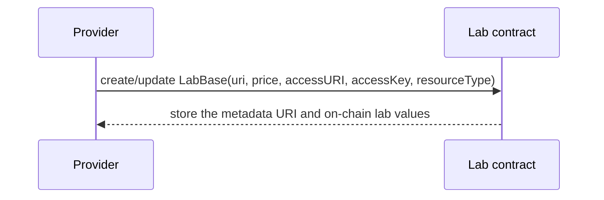

# DecentraLabs lab metadata

This repository documents the metadata for DecentraLabs laboratories and FMU
simulations. A lab is an ERC-721 token identified by `labId`; its on-chain record
points to a JSON document containing human-readable and discovery data.

The metadata document is not an authorization token and it is not the source of truth
for a reservation. Access is granted only after the institutional backend verifies the
reservation and its lifecycle state.

## Sources of truth

The current contract stores the following `LabBase` fields on-chain:

| Field | Type | Meaning |
| --- | --- | --- |
| `uri` | `string` | URI of the off-chain metadata JSON. |
| `price` | `uint96` | Service-credit price per second, in raw credit units. |
| `accessURI` | `string` | Service endpoint used after authorization. |
| `accessKey` | `string` | Provider-side identifier used to resolve the resource. It is not a password. |
| `createdAt` | `uint32` | Creation timestamp recorded by the contract. |
| `resourceType` | `uint8` | `0` for an exclusive physical/remote lab; `1` for a concurrent FMU simulation. |

The reservation contract is authoritative for the reserved start/end timestamps,
price and lifecycle (`PENDING`, `CONFIRMED`, `ACCESS_AUTHORIZED`, `SETTLED` or
`CANCELLED`). Availability values in this document may be enforced when a new
reservation is validated; they do not rewrite an already-created reservation.

DecentraLabs currently uses an internal, non-refundable service-credit ledger. Credits
have seven decimal places (`10,000,000` raw units per credit); the on-chain `price` remains
raw credit units per second. Display prices are converted to that per-second value using
nearest-integer rounding, and consumers should display at least three fractional digits
when exposing converted prices.

## Off-chain document

Every document must contain `name` and `description`. `image` is recommended for ERC-721
wallets and catalogue cards. Use `attributes` for typed discovery, availability, pricing,
booking, documentation and resource-specific data.
The interoperability field catalogue and validation rules are in
[`docs/metadata-schema.md`](docs/metadata-schema.md).

`classification` contains OECD FORD entries (`scheme`, `schemeVersion`, `code`, `label`)
and may include ISCED-F entries when the laboratory is linked to an educational
programme. Pricing, booking and availability values describe catalogue policy and do
not replace the on-chain price or reservation timestamps.

### Resource-specific data

For `resourceType = 0`, metadata describes a physical or remote resource.

For `resourceType = 1`, include FMU discovery traits when known:
`fmiVersion`, `simulationType` (`CoSimulation` or `ModelExchange`), `fmuFileName`,
`defaultStartTime`, `defaultStopTime`, `defaultStepSize`, and `modelVariables`.
Metadata never contains executable content or credentials.

See the [metadata examples](docs/examples.md) for provider-oriented explanations
and complete JSON documents. The standalone fixtures are also available as
[`remote-lab.json`](examples/remote-lab.json),
[`long-reservation-lab.json`](examples/long-reservation-lab.json) and
[`fmu-simulation.json`](examples/fmu-simulation.json).

For a resource designed for multi-hour or multi-day work, see the
[`long-reservation-lab.json`](examples/long-reservation-lab.json) example. Its
`allowedDurationRange` permits one to fourteen days and its `allowedDurations` list is
expressed in days; the final reservation still records immutable Unix-second `start`
and `end` values on-chain. A metadata document cannot extend, shorten or otherwise
alter an existing reservation.

## Validation

Run `node scripts/validate.mjs` to parse every JSON fixture, compare each fixture page
with its canonical JSON file and check relative Markdown links. The same command runs
in [GitHub Actions](.github/workflows/validate.yml) on pushes and pull requests.

## Relationship to on-chain data

## Security and operational rules

- Never put JWTs, private keys, passwords, bearer tokens or session tickets in this JSON.
- Treat `accessKey` as a routing/lookup identifier. Rotate credentials through provider
  configuration, not by exposing secrets in metadata.
- Use HTTPS and stable content identifiers. If a document changes, publish a new URI
  or update the on-chain URI through the provider workflow.
- Keep timestamps in Unix seconds. Interpret `availableHours` using the declared IANA
  `timezone`.
- Validate media and document URLs before publication; metadata is untrusted input and
  must never be executed.
