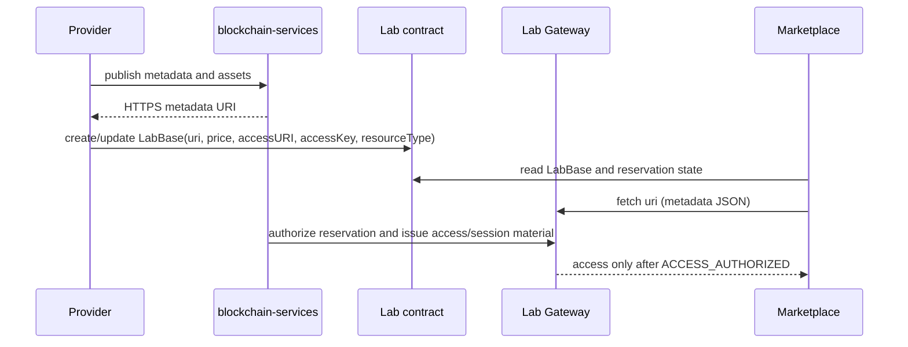

# DecentraLabs lab metadata

This repository documents the metadata exchanged by the DecentraLabs marketplace, the
`Lab Gateway` and the canonical `blockchain-services` backend. A lab is an ERC-721
token identified by `labId`; its on-chain record points to a JSON document containing
human-readable and discovery data.

The metadata document is not an authorization token and it is not the source of truth
for a reservation. Access is granted only after the institutional backend verifies the
reservation and its lifecycle state.

## Sources of truth

The current contract stores the following `LabBase` fields on-chain:

| Field | Type | Meaning |
| --- | --- | --- |
| `uri` | `string` | URI of the off-chain metadata JSON. |
| `price` | `uint96` | Service-credit price per second, in raw credit units. |
| `accessURI` | `string` | Gateway or service endpoint used after authorization. |
| `accessKey` | `string` | Provider-side identifier used to resolve the resource. It is not a password. |
| `createdAt` | `uint32` | Creation timestamp recorded by the contract. |
| `resourceType` | `uint8` | `0` for an exclusive physical/remote lab; `1` for a concurrent FMU simulation. |

The provider/observer authentication configuration is resolved by the backend and is
not an `auth` property in the current `LabBase` structure. Do not add legacy `auth`
or `$LAB` token fields to new documents.

The reservation contract is authoritative for the reserved start/end timestamps,
price and lifecycle (`PENDING`, `CONFIRMED`, `ACCESS_AUTHORIZED`, `SETTLED` or
`CANCELLED`). Availability values in this document may be enforced when a new
reservation is validated; they do not rewrite an already-created reservation.

DecentraLabs currently uses an internal, non-refundable service-credit ledger. Credits
have seven decimal places (`10,000,000` raw units per credit); the on-chain `price` remains
raw credit units per second. Display prices are converted to that per-second value using
nearest-integer rounding, and consumers should display at least three fractional digits
when exposing converted prices. There is no active external `$LAB` token reservation flow.

## Off-chain document

Every document must contain `name` and `description`. `image` is recommended for ERC-721
wallets and marketplace cards. The canonical form stores additional images and
documents as `additionalImages` and `docs` attributes respectively. Both Gateway
publication and Marketplace metadata validation accept top-level `images`/`docs` as
input aliases, merge them into those attributes, and remove the aliases from the
canonical document. Use the attribute form when authoring shared JSON.
The interoperability field catalogue and validation rules are in
[`docs/metadata-schema.md`](docs/metadata-schema.md).

The backend may serve generated documents under `/lab-content/content/{contentId}/`.
The current admin service accepts HTTPS URLs or URLs below the configured gateway base
URL for metadata, images and documentation. Deployment-specific gateways may apply a
stricter policy.

The publisher forms also capture scientific classification: `classification` contains
OECD FORD entries (`scheme`, `schemeVersion`, `code`, `label`) and may include ISCED-F
entries when the laboratory is linked to an educational programme. They persist
`keywords` as an array, not as a single display string. Pricing and booking controls
(`pricing`, `bookingMode`, `allowedDurations` and related fields) are catalogue
metadata; `periodRules.enforceDailyWindow` can additionally make `availableHours`
part of calendar-period admission validation. These fields do not replace the
on-chain price or reservation timestamps.

### Resource-specific data

For `resourceType = 0`, metadata describes a physical or remote resource. The gateway
uses the on-chain access identifier when it provisions Guacamole or another provider
adapter.

For `resourceType = 1`, include FMU discovery traits when known:
`fmiVersion`, `simulationType` (`CoSimulation` or `ModelExchange`), `fmuFileName`,
`defaultStartTime`, `defaultStopTime`, `defaultStepSize`, and `modelVariables`.
The FMU file is stored and executed by Lab Station; metadata never contains executable
content or credentials.

See the [metadata examples](docs/examples.md) for provider-oriented explanations
and complete JSON documents. The standalone fixtures are also available as
[`remote-lab.json`](examples/remote-lab.json),
[`long-reservation-lab.json`](examples/long-reservation-lab.json) and
[`fmu-simulation.json`](examples/fmu-simulation.json).

For a resource designed for multi-hour or multi-day work, see the
[`long-reservation-lab.json`](examples/long-reservation-lab.json) example. Its
`allowedDurationRange` permits one to fourteen days and its `allowedDurations` list is
expressed in days; the final reservation still records immutable Unix-second `start`
and `end` values on-chain. A metadata document cannot extend, shorten or otherwise
alter an existing reservation.

## Validation

Run `node scripts/validate.mjs` to parse every JSON fixture, compare each fixture page
with its canonical JSON file and check relative Markdown links. The same command runs
in [GitHub Actions](.github/workflows/validate.yml) on pushes and pull requests.

## Publication flow

## Security and operational rules

- Never put JWTs, private keys, passwords, bearer tokens or session tickets in this JSON.
- Treat `accessKey` as a routing/lookup identifier. Rotate credentials through the
  gateway and backend configuration, not by exposing secrets in metadata.
- Use HTTPS and stable content identifiers. If a document changes, publish a new URI
  or update the on-chain URI through the provider workflow; consumers may cache old
  content.
- Keep timestamps in Unix seconds. Interpret `availableHours` using the declared IANA
  `timezone`.
- Validate media and document URLs before publication; metadata is untrusted input and
  must never be executed.

## Canonical implementations

- [`LibAppStorage.sol`](https://github.com/DecentraLabsCom/Smart-Contracts/blob/main/contracts/libraries/LibAppStorage.sol)
- [`LabQueryFacet.sol`](https://github.com/DecentraLabsCom/Smart-Contracts/blob/main/contracts/facets/lab/LabQueryFacet.sol)
- [`LabAdminService.java`](https://github.com/DecentraLabsCom/Lab-Gateway/blob/main/blockchain-services/src/main/java/decentralabs/blockchain/service/labadmin/LabAdminService.java)
- [`example-lab-metadata.md`](https://github.com/DecentraLabsCom/Lab-Gateway/blob/main/blockchain-services/docs/reference/example-lab-metadata.md)
- [`resourceType.js`](https://github.com/DecentraLabsCom/Marketplace/blob/main/src/utils/resourceType.js)
