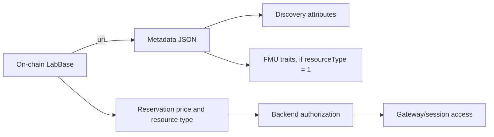

# Metadata schema

This is the normative off-chain shape. JSON object keys are case-sensitive.

## Top-level fields

| Field | Required | Type | Notes |
| --- | --- | --- | --- |
| `name` | yes | string | Human-readable lab or simulation name. |
| `description` | yes | string | Human-readable description. |
| `image` | recommended | string | Primary HTTPS or gateway URL. |
| `images` | no | string[] | Optional normalized media list for consumers. The publisher form uses `additionalImages` below. |
| `docs` | no | string[] | Optional documentation URLs; the publisher form writes them as a `docs` attribute. |
| `attributes` | no | object[] | Objects with `trait_type` and `value`. |

The active backend requires `name` and `description` and validates URL schemes. The
publisher form stores the primary image in `image` and extra media in the
`additionalImages` attribute. Consumers may combine those values into an `images`
list; a top-level `images` list is also accepted for interoperability.

`contentId` is a publish-request control used by the Gateway to choose a storage
directory; it is removed before the metadata JSON is persisted and is not part of the
document schema.

## Standard attributes

`category` (legacy display alias), `keywords`, `timeSlots` (minutes), `opens`, `closes`, `availableDays`,
`availableHours`, `timezone`, `maxConcurrentUsers`, `unavailableWindows`, and
`termsOfUse` are discovery and policy fields. Use Unix seconds for timestamps and
`HH:mm` for local hours. `maxConcurrentUsers` is meaningful for FMU resources; the
on-chain numeric `resourceType` remains authoritative (`0` = lab, `1` = FMU). For
metadata consumers, the equivalent attribute values are conventionally `lab` and
`fmu`.

For documents produced by the full publisher form, `classification`, `pricing`,
`bookingMode`, `allowedDurations`, `opens`, `closes`, `availableDays`, `timezone`,
`resourceType`, `maxConcurrentUsers` and `unavailableWindows` are emitted on every
save. `termsOfUse`, `docs` and `additionalImages` are also emitted, but may contain an
empty object or array when the provider has not supplied those optional values.

The recommended shapes are:

| Attribute | Shape |
| --- | --- |
| `availableDays` | Array of uppercase weekday names (`MONDAY` … `SUNDAY`). |
| `availableHours` | `{ "start": "HH:mm", "end": "HH:mm" }`. |
| `unavailableWindows` | Array of `{ "startUnix": number, "endUnix": number, "reason": string }`. |
| `termsOfUse` | `{ "url": string, "version": string, "effectiveDate": number, "sha256": string? }`; `effectiveDate` is Unix seconds and `sha256`, when present, is a lowercase 64-character hex digest. |

The publisher forms also emit:

| Attribute | Meaning |
| --- | --- |
| `classification` | Array of `{ scheme, schemeVersion, code, label }`; current schemes are `OECD-FORD` and optional `ISCED-F`. |
| `classificationPrimaryScheme` | Usually `OECD-FORD`. |
| `educationalProgramLinked` | Boolean indicating that ISCED-F fields are intentionally linked. |
| `pricing` | `{ displayAmount, displayUnit, rawPricePerSecond, roundingMode, billingMode }`. |
| `bookingMode` | `slot` for minute slots or `calendar-period` for day/week/month ranges. |
| `allowedDurationRange` | `{ unit, min, max }` for calendar-period bookings. |
| `allowedDurations` | Expanded duration options, each `{ unit, value }`. |
| `periodRules` | `{ startGranularity, allowCustomDateRange, minDurationDays, maxDurationDays }`. |

These fields describe catalog and billing presentation. The contract's raw `price` and
the reservation's immutable timestamps remain authoritative for settlement.

The current Marketplace and Gateway publisher forms write these values as an
`attributes` entry with `trait_type: "pricing"`. The backend metadata parser also
accepts the same object at the document root; new documents should keep it under
`attributes`.

`classification` is the canonical category representation produced by the current
forms. A simple `category` string may be retained as a backwards-compatible display
alias, but it must not be used instead of the coded classification.

FMU documents may additionally expose `fmiVersion`, `simulationType`, `fmuFileName`,
`defaultStartTime`, `defaultStopTime`, `defaultStepSize`, and `modelVariables`.
`modelVariables` is an array of descriptors such as `{ name, causality, type, unit,
start }`; the descriptor may contain additional FMI fields returned by the station.
The publisher requires `fmuFileName` for an FMU resource. The auto-described trio
`fmiVersion`, `simulationType` and `modelVariables` may be absent when discovery is
unavailable; once one is present, the publisher expects all three to be coherent.

See the [metadata examples](examples.md), or download the complete JSON fixtures:
[`remote-lab.json`](../examples/remote-lab.json),
[`long-reservation-lab.json`](../examples/long-reservation-lab.json) and
[`fmu-simulation.json`](../examples/fmu-simulation.json).
