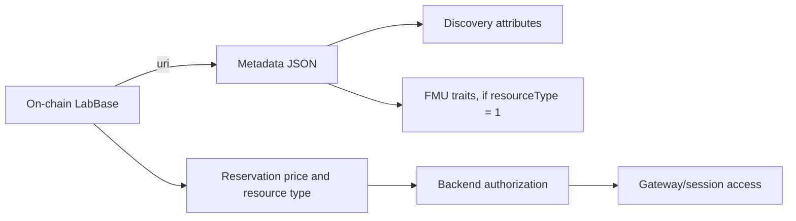

# Metadata schema

This is the normative off-chain shape. JSON object keys are case-sensitive.

## Top-level fields

| Field | Required | Type | Notes |
| --- | --- | --- | --- |
| `name` | yes | string | Human-readable lab or simulation name. |
| `description` | yes | string | Human-readable description. |
| `image` | recommended | string | Primary HTTPS or gateway URL. |
| `demoEnabled` | no | boolean | Catalogue display flag indicating that a provider offers a public demo. It does not grant access or bypass reservation and Gateway authorization. |
| `images` | no | string[] | Input alias; merged after `image` into the canonical `additionalImages` attribute and then removed. |
| `docs` | no | string[] | Input alias; merged into the canonical `docs` attribute and then removed. |
| `periodRules` | no | object | Input alias; normalized into the canonical `periodRules` attribute and then removed. |
| `attributes` | no | object[] | Objects with `trait_type` and `value`. |

The active backend requires `name` and `description` and validates URL schemes. The
canonical publisher form stores the primary image in `image` and extra media in the
`additionalImages` attribute. Consumers may combine those values into an `images`
list, but a top-level `images` list is only an input alias.

`contentId` is a publish-request control used by the Gateway to choose a storage
directory; it is removed before the metadata JSON is persisted and is not part of the
document schema.
For cross-consumer documents, keep additional images and documentation in
`attributes` (`additionalImages` and `docs`). Both the Gateway publication normalizer
and Marketplace's metadata sanitizer accept root `images` and `docs` as input aliases,
merge and deduplicate them with the attribute values, and expose only the canonical
attribute form afterwards.
The same input normalization applies to a root `periodRules` object; when both root
and attribute forms are present, the attribute form takes precedence.

## Standard attributes

`category` (legacy Gateway display alias), `keywords`, `timeSlots` (minutes), `opens`, `closes`, `availableDays`,
`availableHours`, `timezone`, `maxConcurrentUsers`, `unavailableWindows`, and
`termsOfUse` are discovery and policy fields. Use Unix seconds for timestamps and
`HH:mm` for local hours. `maxConcurrentUsers` is meaningful for FMU resources; the
on-chain numeric `resourceType` remains authoritative (`0` = lab, `1` = FMU). For
metadata consumers, the equivalent attribute values are conventionally `lab` and
`fmu`.

For documents produced by the full publisher form, `classification`, `pricing`,
`bookingMode`, `allowedDurations`, `opens`, `closes`, `availableDays`, `timezone`,
`resourceType`, `maxConcurrentUsers` and `unavailableWindows` are emitted on every
save. `termsOfUse`, `docs` and `additionalImages` are also emitted, but may contain an
empty object or array when the provider has not supplied those optional values.

The recommended shapes are:

| Attribute | Shape |
| --- | --- |
| `availableDays` | Array of uppercase weekday names (`MONDAY` … `SUNDAY`). |
| `availableHours` | `{ "start": "HH:mm", "end": "HH:mm" }`. |
| `unavailableWindows` | Array of `{ "startUnix": number, "endUnix": number, "reason": string }`. |
| `termsOfUse` | `{ "url": string, "version": string, "effectiveDate": number, "sha256": string? }`; serialized `effectiveDate` is Unix seconds and `sha256`, when present, is a lowercase 64-character hex digest. |

Marketplace and Gateway normalize a date-only input such as `2026-01-01` at
UTC midnight, or a numeric-string epoch, to the same numeric Unix-seconds value
before it is persisted or consumed.

The publisher forms also emit:

| Attribute | Meaning |
| --- | --- |
| `classification` | Array of `{ scheme, schemeVersion, code, label }`; current schemes are `OECD-FORD` and optional `ISCED-F`. |
| `classificationPrimaryScheme` | Usually `OECD-FORD`. |
| `educationalProgramLinked` | Boolean indicating that ISCED-F fields are intentionally linked. |
| `pricing` | `{ displayAmount, displayUnit, rawPricePerSecond, roundingMode, billingMode }`; `rawPricePerSecond` uses 10,000,000 raw units per credit and `roundingMode` is `nearest-per-second`. |
| `bookingMode` | `slot` for minute slots or `calendar-period` for day/week/month ranges. |
| `allowedDurationRange` | `{ unit, min, max }` for calendar-period bookings. |
| `allowedDurations` | Expanded duration options, each `{ unit, value }`. |
| `periodRules` | `{ startGranularity, minimumNoticeHours?, allowCustomDateRange, minDurationDays, maxDurationDays, enforceDailyWindow? }`. |

These fields describe catalog and billing presentation. The contract's raw `price` and
the reservation's immutable timestamps remain authoritative for settlement.

`enforceDailyWindow` is relevant to `calendar-period` bookings: when `true`, the
backend applies `availableHours` to the booking start and end; when omitted or
`false`, long-running bookings are not restricted by that daily window. The current
publisher form emits the four required duration fields and leaves this switch off.
`minimumNoticeHours` is accepted as metadata for future policy enforcement but is not
currently applied by the availability validator.

The current Marketplace calendar-period form does not expose time-of-day controls and
submits period boundaries at midnight. Therefore, a document that sets
`enforceDailyWindow: true` with an `availableHours` range that excludes midnight may
be rejected by the Gateway; use compatible boundary times until the form supports
that policy explicitly.

For an hourly display amount, `rawPricePerSecond` is the nearest integer to
`displayAmount * 10,000,000 / 3,600`. For day/week/month displays, convert the
corresponding calendar duration to seconds first. Keep the raw value as a string to
avoid JavaScript number precision loss.

The current Marketplace and Gateway publisher forms write these values as an
`attributes` entry with `trait_type: "pricing"`. The backend metadata parser also
accepts the same object at the document root; new documents should keep it under
`attributes`.

`classification` is the canonical category representation produced by the current
forms. The Gateway parser still understands a simple `category` string for display,
but Marketplace sanitization drops that legacy trait; it must not be used instead of
the coded classification.

FMU documents may additionally expose `fmiVersion`, `simulationType`, `fmuFileName`,
`defaultStartTime`, `defaultStopTime`, `defaultStepSize`, and `modelVariables`.
`modelVariables` is an array of descriptors such as `{ name, causality, type, unit,
start }`; the descriptor may contain additional FMI fields returned by the station.
The publisher requires `fmuFileName` for an FMU resource. The auto-described trio
`fmiVersion`, `simulationType` and `modelVariables` may be absent when discovery is
unavailable; once one is present, the publisher expects all three to be coherent.

See the [metadata examples](examples.md), or download the complete JSON fixtures:
[`remote-lab.json`](../examples/remote-lab.json),
[`long-reservation-lab.json`](../examples/long-reservation-lab.json) and
[`fmu-simulation.json`](../examples/fmu-simulation.json).
